# Grupo12_Taller_Modelos_No_Supervisados


## Análisis de modelos no supervisados aplicado al dataset salarial de Cervecería 2025

Repositorio académico desarrollado para la asignatura **Aprendizaje Automático**, orientado a la aplicación de técnicas de **aprendizaje no supervisado** sobre un dataset salarial de Cervecería 2025.

El proyecto utiliza modelos de segmentación, reducción de dimensionalidad y detección de anomalías para identificar **perfiles salariales diferenciados**, **patrones internos de compensación** y **registros estadísticamente atípicos** que podrían requerir revisión técnica o administrativa.

> **Nota de uso responsable:** los registros detectados como anomalías no deben interpretarse automáticamente como errores, fraude o irregularidades comprobadas. Los modelos generan alertas estadísticas que deben validarse con contexto administrativo, documental y operativo.

---

## Repositorio en GitHub

La documentación y los archivos del proyecto están disponibles en:

[Repositorio Grupo12_Taller_Modelos_No_Supervisados](https://github.com/schubertlombeida/Grupo12_Taller_Modelos_No_Supervisados)

---

## Integrantes

- Niko Dimitri Jiménez Bruno
- José Luis Peñafiel Fernández
- Juan Carlos Bajaña Gutiérrez
- Schubert Stalin Lombeida Manjarrez

**Profesor:** Gladys María Villegas Rugel  
**Materia:** Aprendizaje Automático  
**Fecha:** 13 de mayo de 2026  

---

## Problema de análisis

El dataset contiene información relacionada con remuneraciones, horas extra, beneficios y composición salarial de empleados. El problema de análisis consiste en determinar si existen **perfiles salariales diferenciados** y **registros atípicos** dentro de la nómina, utilizando técnicas de aprendizaje no supervisado.

### Pregunta guía

> ¿Es posible identificar perfiles salariales diferenciados y registros atípicos en la nómina mediante modelos no supervisados, utilizando variables relacionadas con salario, horas extra y beneficios?

Este enfoque es adecuado porque no se utiliza una variable objetivo para entrenar los modelos. Los algoritmos descubren estructuras internas del dataset a partir de similitudes, densidades, distancias y patrones de comportamiento entre observaciones.

---

## Justificación

El análisis de compensaciones mediante aprendizaje no supervisado permite transformar un conjunto amplio de registros salariales en información útil para la gestión empresarial.

Desde una perspectiva técnica, el análisis permite:

- segmentar empleados según perfiles de compensación;
- identificar patrones asociados a salario total, horas extra y beneficios;
- detectar registros con comportamiento estadísticamente diferente;
- priorizar revisiones internas con base en evidencia cuantitativa;
- apoyar procesos de control interno, nómina, talento humano y finanzas.

El propósito del ejercicio no es emitir juicios administrativos definitivos, sino construir una base analítica que permita orientar revisiones técnicas y mejorar la comprensión de la estructura salarial.

---

## Estructura del repositorio

```text
Grupo12_Taller_Modelos_No_Supervisados/
│
├── README.md
├── requirements.txt
├── .gitignore
│
├── data/
│   └── raw/
│       └── Salarios_Cerveceria_2025.csv
│
├── notebooks/
│   └── 01_modelos_no_supervisados_cerveceria.ipynb
│
├── images/
│   ├── 01_distribucion_departamentos.png
│   ├── 02_distribuciones_variables_salariales.png
│   ├── 03_metodo_codo_kmeans.png
│   ├── 04_silhouette_kmeans.png
│   ├── 05_segmentacion_kmeans.png
│   ├── 06_kdistance_dbscan.png
│   ├── 07_segmentacion_dbscan.png
│   ├── 08_pca_clusters_kmeans.png
│   ├── 09_varianza_pca.png
│   ├── 10_anomalias_isolation_forest.png
│   ├── 11_anomalias_lof.png
│   ├── 12_comparacion_anomalias_modelos.png
│   └── 13_comparacion_cantidad_anomalias.png
│
├── reports/
│   ├── Grupo12_Informe_Resultados_Modelos_No_Supervisados.docx
│   ├── Grupo12_Modelos_No_Supervisados.pptx
│   ├── resultados_modelo_cerveceria.csv
│   ├── anomalias_ambos_modelos.csv
│   ├── resumen_anomalias_modelos.csv
│   ├── resumen_clusters_kmeans.csv
│   └── metricas_resumen.json
│
└── docs/
```

---

## Archivos principales para revisión

| Tipo | Archivo | Descripción |
|---|---|---|
| Dataset | [`data/raw/Salarios_Cerveceria_2025.csv`](data/raw/Salarios_Cerveceria_2025.csv) | Dataset original utilizado para el análisis. |
| Notebook | [`notebooks/01_modelos_no_supervisados_cerveceria.ipynb`](notebooks/01_modelos_no_supervisados_cerveceria.ipynb) | Desarrollo completo del ejercicio en Python. |
| Informe | [`reports/Grupo12_Informe_Resultados_Modelos_No_Supervisados.docx`](reports/Grupo12_Informe_Resultados_Modelos_No_Supervisados.docx) | Informe formal de resultados. |
| Presentación | [`reports/Grupo12_Modelos_No_Supervisados.pptx`](reports/Grupo12_Modelos_No_Supervisados.pptx) | Presentación ejecutiva del análisis. |
| Resultados | [`reports/resultados_modelo_cerveceria.csv`](reports/resultados_modelo_cerveceria.csv) | Dataset con etiquetas de modelos y resultados por registro. |
| Anomalías prioritarias | [`reports/anomalias_ambos_modelos.csv`](reports/anomalias_ambos_modelos.csv) | Registros detectados simultáneamente por Isolation Forest y LOF. |
| Resumen de anomalías | [`reports/resumen_anomalias_modelos.csv`](reports/resumen_anomalias_modelos.csv) | Conteo comparativo de anomalías por modelo. |
| Resumen de clústeres | [`reports/resumen_clusters_kmeans.csv`](reports/resumen_clusters_kmeans.csv) | Perfil resumido de los clústeres de K-Means. |

---

## Dataset utilizado

| Elemento | Valor |
|---|---:|
| Registros originales | 8,382 |
| Columnas originales | 14 |
| Año analizado | 2025 |
| Registros procesados para modelado | 8,382 |
| Valores faltantes en `HorasExtra` | 150 |
| Valores faltantes en `Beneficios` | 377 |
| Valores faltantes en `TipoContrato` | 1,200 |

### Variables derivadas utilizadas

| Variable | Interpretación |
|---|---|
| `LogSalarioTotal` | Transformación logarítmica del salario total para reducir asimetrías. |
| `OvertimeRatio` | Proporción de horas extra frente al salario o componente base. |
| `BeneficiosRatio` | Peso relativo de los beneficios dentro de la compensación. |
| `ExtraVsBase` | Relación entre pagos extra y salario base. |
| `BeneficiosVsSalario` | Relación entre beneficios y salario. |

---

## Metodología aplicada

El notebook siguió una metodología estructurada en las siguientes fases:

1. **Exploración inicial del dataset:** revisión de dimensiones, variables, tipos de datos, valores faltantes y distribuciones.
2. **Preprocesamiento:** conversión de variables numéricas, imputación de valores faltantes y tratamiento de valores extremos mediante winsorización IQR.
3. **Feature engineering:** construcción de variables proporcionales para representar mejor la composición salarial.
4. **Escalamiento:** estandarización de variables con `StandardScaler`.
5. **Clustering:** aplicación de `K-Means` y `DBSCAN`.
6. **Reducción de dimensionalidad:** uso de `PCA` para visualización bidimensional.
7. **Detección de anomalías:** aplicación de `Isolation Forest` y `Local Outlier Factor`.
8. **Comparación de modelos:** análisis de sensibilidad, coincidencias y utilidad técnica de cada modelo.

---

## Visualizaciones exportadas

Las visualizaciones generadas durante el análisis se encuentran en la carpeta [`images/`](images/).

### Distribución y exploración inicial

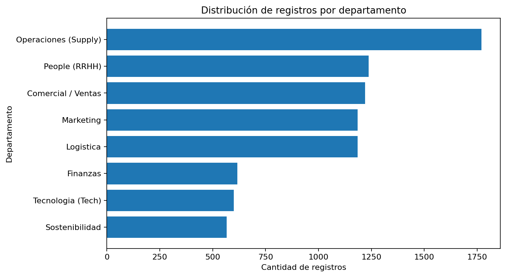

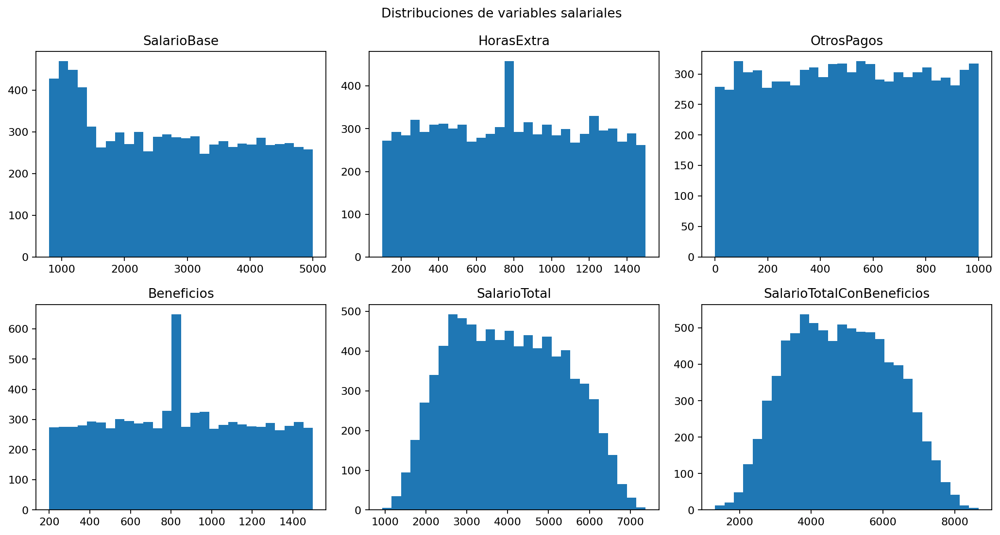

### Clustering con K-Means

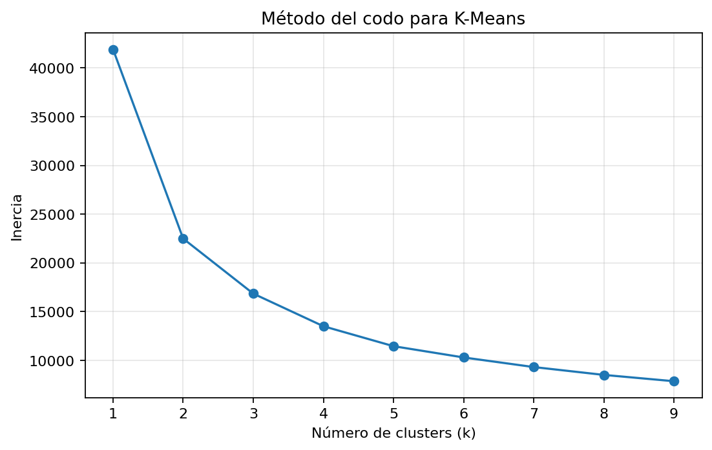

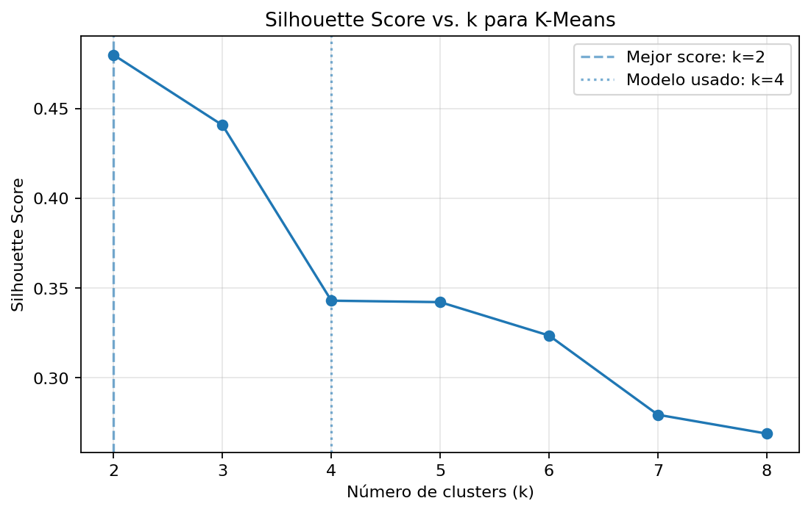

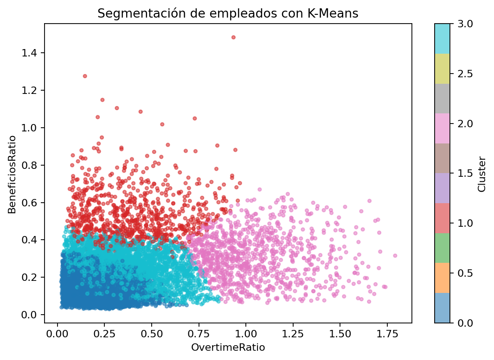

### DBSCAN

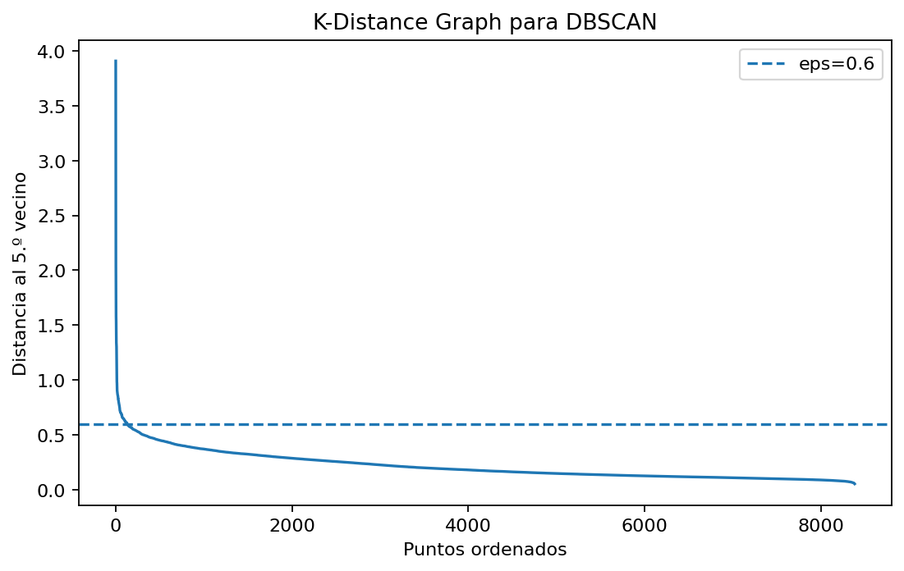

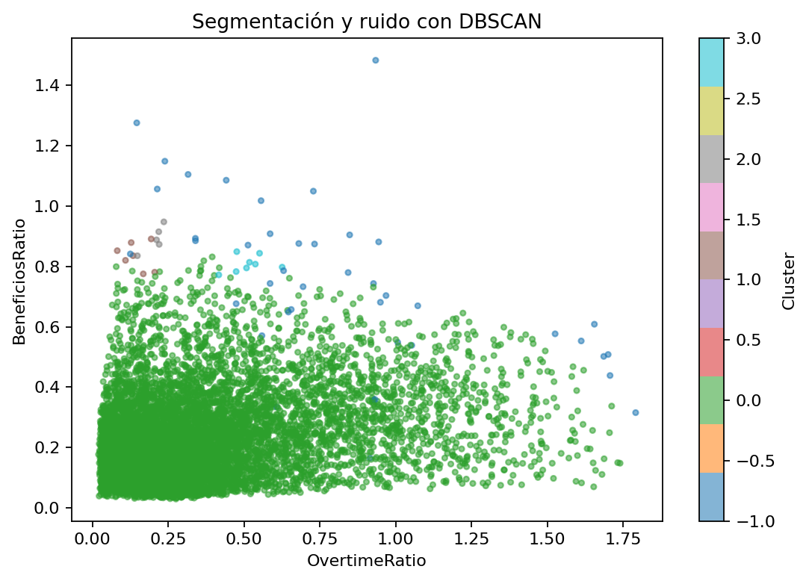

### PCA

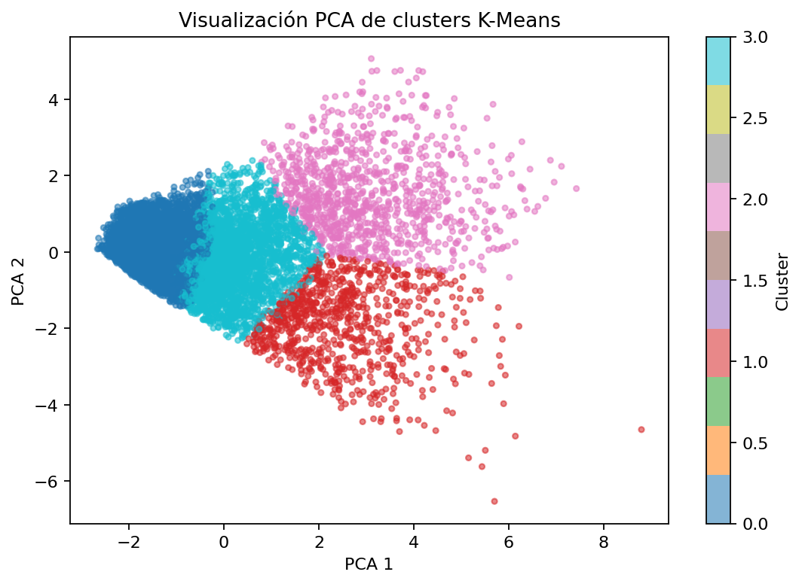

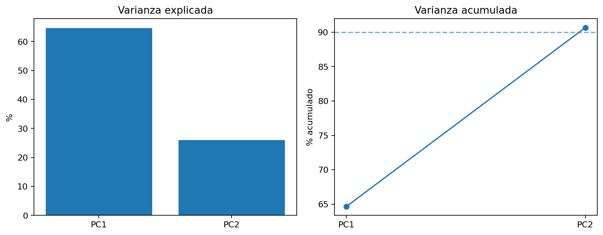

### Detección de anomalías

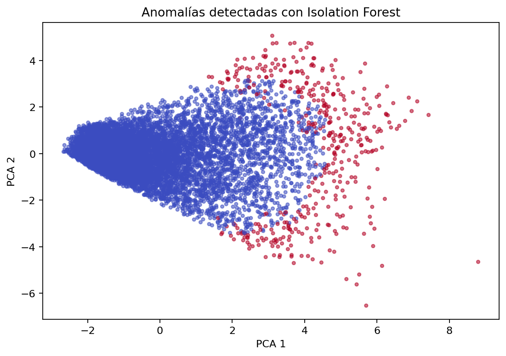

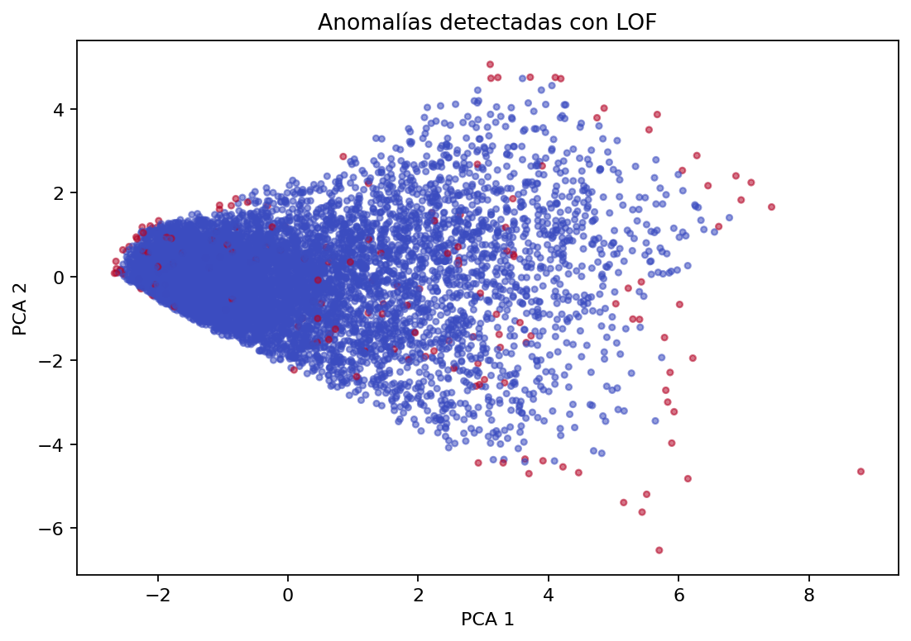

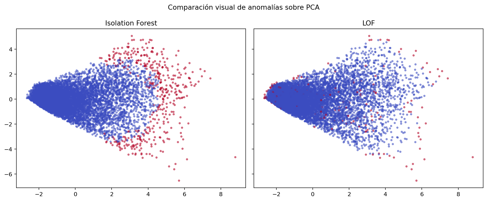

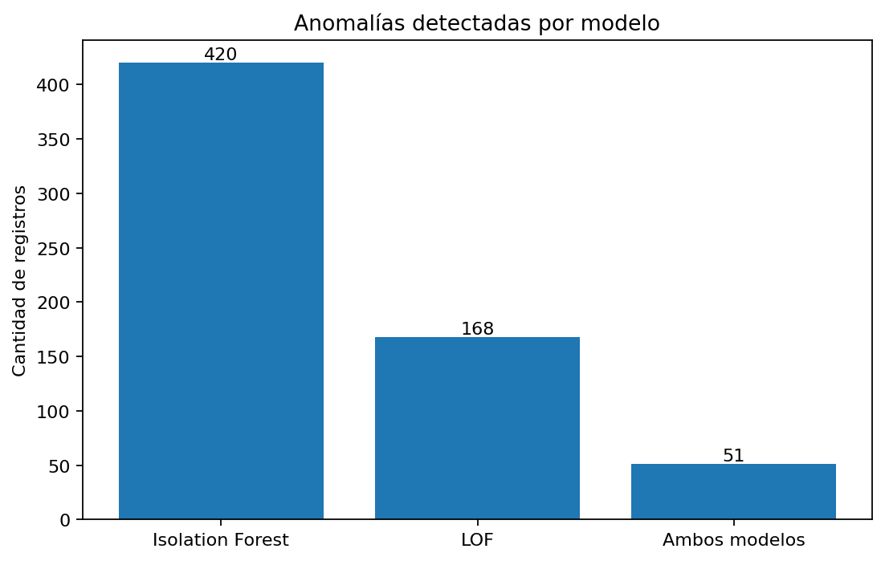

---

## Resultados principales

### 1. K-Means

K-Means segmentó los registros en **cuatro perfiles interpretativos**. Aunque el mejor valor cuantitativo de Silhouette Score se observó con `k = 2`, se mantuvo `k = 4` para lograr una lectura más granular y útil desde el punto de vista empresarial.

| k | Silhouette Score |
|---:|---:|
| 2 | 0.4798 |
| 3 | 0.4407 |
| 4 | 0.3430 |
| 5 | 0.3422 |
| 6 | 0.3236 |
| 7 | 0.2795 |
| 8 | 0.2690 |

#### Perfil de clústeres K-Means

| Cluster | LogSalarioTotal | OvertimeRatio | BeneficiosRatio | Registros |
|---:|---:|---:|---:|---:|
| 0 | 8.5233 | 0.2143 | 0.1520 | 4,095 |
| 1 | 7.6656 | 0.4057 | 0.5440 | 812 |
| 2 | 7.9395 | 1.0446 | 0.3124 | 989 |
| 3 | 8.0717 | 0.3816 | 0.2594 | 2,486 |

**Interpretación técnica:**  
Los clústeres permiten identificar perfiles salariales diferenciados. En particular, se observa un grupo con mayor proporción de horas extra y otro con mayor peso relativo de beneficios, lo que puede ser útil para revisar políticas de compensación, cargas laborales y estructura de pagos variables.

---

### 2. DBSCAN

DBSCAN identificó:

| Resultado | Valor |
|---|---:|
| Clústeres identificados, sin considerar ruido | 4 |
| Registros clasificados como ruido | 41 |

**Interpretación técnica:**  
Los 41 registros clasificados como ruido corresponden a observaciones de baja densidad que no se integran claramente a los grupos principales. Estos casos pueden representar perfiles especiales, pagos excepcionales, estructuras contractuales particulares o registros que requieren validación individual.

---

### 3. PCA

PCA permitió representar el dataset en dos dimensiones conservando aproximadamente **90.7% de la varianza total**.

| Componente | Varianza explicada |
|---|---:|
| PCA 1 | 64.7% |
| PCA 2 | 26.0% |
| Total acumulado | 90.7% |

**Interpretación técnica:**  
La alta varianza explicada en dos componentes permite visualizar adecuadamente la separación de perfiles y anomalías, facilitando la comunicación de resultados técnicos a públicos no especializados.

---

### 4. Detección de anomalías

| Modelo | Registros normales | Anomalías detectadas | Porcentaje |
|---|---:|---:|---:|
| Isolation Forest | 7,962 | 420 | 5.0% |
| Local Outlier Factor | 8,214 | 168 | 2.0% |
| Coincidencia entre ambos modelos | No aplica | 51 | 0.6% |

**Interpretación técnica:**  
Isolation Forest fue más sensible y detectó una mayor cantidad de anomalías globales. LOF fue más conservador y se enfocó en desviaciones respecto al entorno local de cada registro. La coincidencia de **51 registros** entre ambos modelos constituye el principal grupo de revisión prioritaria.

---

## Análisis comparativo entre modelos

| Modelo | Enfoque | Resultado principal | Uso técnico recomendado |
|---|---|---|---|
| K-Means | Centroides | 4 perfiles salariales interpretativos | Segmentar perfiles generales de compensación. |
| DBSCAN | Densidad | 4 clústeres y 41 puntos de ruido | Detectar perfiles de baja densidad y casos poco frecuentes. |
| PCA | Reducción dimensional | 90.7% de varianza en 2D | Visualizar patrones, clústeres y anomalías. |
| Isolation Forest | Aislamiento global | 420 anomalías | Generar alertas amplias sobre registros atípicos. |
| LOF | Densidad local | 168 anomalías | Confirmar casos atípicos respecto a registros similares. |

---

## Conclusiones técnicas

El análisis no supervisado permitió identificar que la nómina de Cervecería 2025 presenta perfiles salariales diferenciados, principalmente asociados a variaciones en el salario total, las horas extra, los beneficios y otros componentes de compensación.

La segmentación mediante K-Means agrupó los registros en cuatro perfiles interpretativos. Estos grupos pueden servir como referencia técnica para analizar la coherencia interna de la estructura salarial y comparar empleados con características similares.

Uno de los principales hallazgos corresponde a la existencia de perfiles con mayor proporción de horas extra. Este resultado puede estar relacionado con diferencias operativas, concentración de carga laboral, turnos específicos o necesidades particulares de personal en determinadas áreas.

También se identificaron perfiles donde los beneficios tienen un peso relevante frente al pago total. Este resultado evidencia la importancia de revisar la compensación desde una perspectiva integral, considerando no solo el salario base, sino también beneficios, pagos adicionales y composición total de la remuneración.

DBSCAN detectó 41 registros clasificados como ruido, es decir, observaciones que no se integran claramente a los grupos principales. Estos casos deben considerarse perfiles poco frecuentes o especiales, sujetos a revisión administrativa para determinar si responden a condiciones laborales justificadas.

Isolation Forest identificó 420 registros atípicos, mientras que LOF detectó 168. Esta diferencia demuestra que ambos modelos tienen niveles distintos de sensibilidad: Isolation Forest captura desviaciones más amplias respecto al comportamiento general, mientras que LOF actúa de forma más conservadora al comparar cada registro con su entorno más cercano.

El hallazgo más relevante corresponde a los 51 registros coincidentes entre Isolation Forest y LOF. Estos casos deben considerarse prioridad técnica de revisión, debido a que fueron detectados como atípicos por dos enfoques metodológicos diferentes.

Los resultados obtenidos no constituyen evidencia directa de errores, inconsistencias o irregularidades en la nómina. Sin embargo, sí representan alertas estadísticas útiles para orientar procesos de revisión interna, validación documental y análisis de políticas de compensación.

---

## Recomendaciones técnicas

A partir de los resultados obtenidos, se recomienda que la empresa priorice la revisión de los **51 registros detectados simultáneamente como anómalos por Isolation Forest y Local Outlier Factor**, debido a que la coincidencia entre ambos modelos incrementa la probabilidad de que estos casos presenten comportamientos salariales significativamente distintos al patrón general de la nómina.

Se recomienda analizar estos registros considerando variables administrativas complementarias como cargo, departamento, tipo de contrato, jornada laboral, centro de costo, nivel jerárquico y autorización de pagos variables. Esta revisión permitiría determinar si las diferencias identificadas corresponden a condiciones laborales justificadas o si requieren una validación adicional por parte del área de Talento Humano, Nómina o Control Interno.

Respecto a los resultados de K-Means, se recomienda utilizar los cuatro clústeres identificados como una herramienta de segmentación salarial para comprender mejor los distintos perfiles de compensación existentes dentro de la empresa. Esta segmentación puede servir como insumo para evaluar la coherencia interna de la estructura salarial y detectar diferencias relevantes entre grupos de empleados.

En el caso del clúster con mayor proporción de horas extra, se recomienda revisar la distribución de cargas laborales, turnos, necesidades operativas y frecuencia de pagos extraordinarios. Un nivel elevado de horas extra podría estar asociado a alta demanda operativa, déficit de personal, concentración de tareas en ciertos cargos o áreas específicas.

En relación con el clúster que presenta una mayor proporción de beneficios frente al salario total, se recomienda validar que dichos beneficios estén alineados con las políticas internas de compensación y con criterios homogéneos por cargo, departamento y tipo de contrato.

Los 41 registros clasificados como ruido por DBSCAN deben ser revisados como casos de baja densidad o perfiles poco frecuentes. Estos registros no necesariamente representan errores, pero sí corresponden a observaciones que no se agrupan claramente con el comportamiento general de la nómina.

Se recomienda utilizar Isolation Forest como modelo de alerta amplia, debido a que identificó un mayor número de posibles anomalías, y LOF como mecanismo de validación más conservador, ya que detectó menos casos, pero con mayor sensibilidad al contexto local de cada registro.

Finalmente, se recomienda institucionalizar este tipo de análisis como una herramienta periódica de apoyo a la gestión de nómina, aplicándolo de forma mensual, trimestral o semestral, para monitorear desviaciones salariales, cambios en patrones de beneficios, concentración de horas extra y evolución de perfiles de compensación.

---

## Cómo ejecutar el notebook

### 1. Clonar el repositorio

```bash
git clone https://github.com/schubertlombeida/Grupo12_Taller_Modelos_No_Supervisados.git
cd Grupo12_Taller_Modelos_No_Supervisados
```

### 2. Instalar dependencias

```bash
pip install -r requirements.txt
```

### 3. Ejecutar Jupyter Notebook

```bash
jupyter notebook
```

Luego abrir:

```text
notebooks/01_modelos_no_supervisados_cerveceria.ipynb
```

---

## Librerías utilizadas

Las principales librerías utilizadas en el notebook son:

- `pandas`
- `numpy`
- `matplotlib`
- `seaborn`
- `scikit-learn`
- `jupyter`
- `openpyxl`

---

## Verificación rápida del entregable

| Criterio | Estado |
|---|---|
| Repositorio organizado por carpetas | Cumplido |
| Dataset incluido | Cumplido |
| Notebook final incluido | Cumplido |
| Visualizaciones exportadas | Cumplido |
| Informe de resultados incluido | Cumplido |
| Presentación incluida | Cumplido |
| Archivos de resultados y anomalías incluidos | Cumplido |
| README con justificación, metodología, resultados y análisis | Cumplido |

---

## Limitaciones del análisis

- Los modelos no supervisados no prueban causalidad ni identifican irregularidades por sí solos.
- La interpretación de anomalías depende del contexto administrativo y de las políticas internas de compensación.
- La selección de parámetros como `k`, `eps`, `min_samples`, `contamination` y número de vecinos puede modificar los resultados.
- Los resultados deben considerarse como apoyo técnico para priorizar revisiones, no como decisiones automáticas.

---

## Licencia y uso académico

Este repositorio fue elaborado con fines académicos para la asignatura **Aprendizaje Automático**.

Si el dataset contiene información identificable, se recomienda publicar únicamente una versión anonimizada o sintética, preservando la confidencialidad de personas y datos sensibles.

---

## Síntesis ejecutiva

El análisis aplicado al dataset salarial de Cervecería 2025 permitió identificar **4 perfiles salariales**, **41 registros de baja densidad con DBSCAN**, **420 anomalías con Isolation Forest**, **168 anomalías con LOF** y **51 registros coincidentes entre ambos modelos de anomalías**.

Estos resultados aportan una base técnica para priorizar revisiones internas, fortalecer el control de nómina y comprender mejor la estructura de compensación de la organización.
